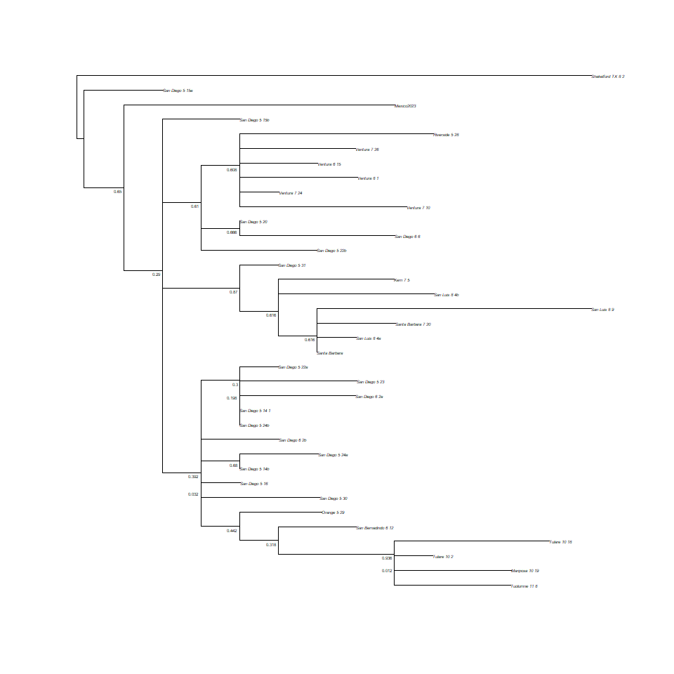
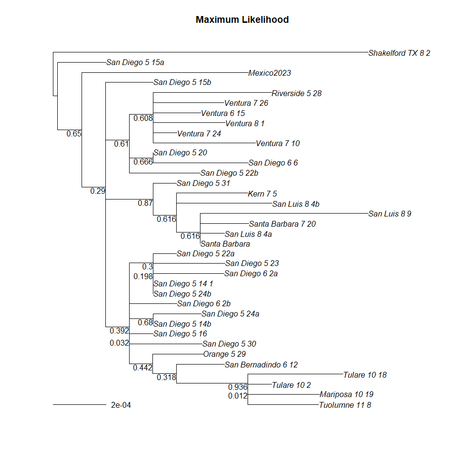
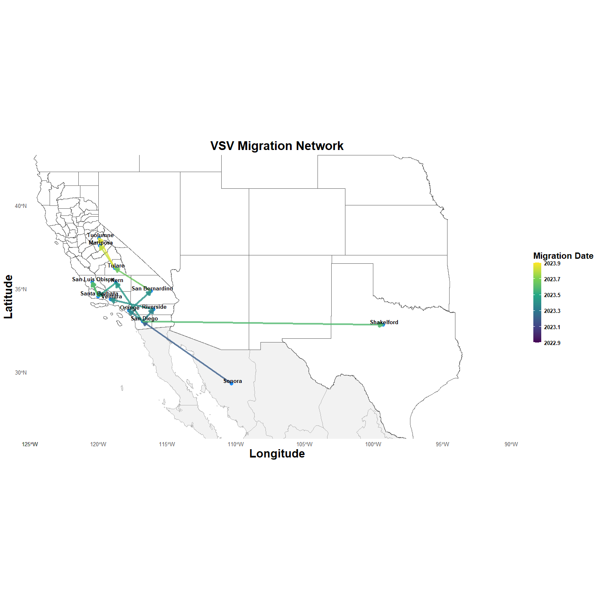

VSV 2023 California Outbreak
================
4/18/25

- <a href="#preliminaries" id="toc-preliminaries">Preliminaries</a>
- <a href="#geographic-boundaries"
  id="toc-geographic-boundaries">Geographic Boundaries</a>
- <a href="#vsv-data" id="toc-vsv-data">VSV Data</a>
- <a href="#substitution-model" id="toc-substitution-model">Substitution
  Model</a>
- <a href="#maximum-likelihood-tree"
  id="toc-maximum-likelihood-tree">Maximum Likelihood Tree</a>
- <a href="#bootstrap" id="toc-bootstrap">Bootstrap</a>
- <a href="#time-calibrated-tree" id="toc-time-calibrated-tree">Time
  Calibrated Tree</a>
- <a href="#geographic-signal" id="toc-geographic-signal">Geographic
  Signal</a>
- <a href="#phylodynamics-ne" id="toc-phylodynamics-ne">Phylodynamics
  (Ne)</a>
- <a href="#phylogeography" id="toc-phylogeography">Phylogeography</a>

## Preliminaries

### Libraries

<details open>
<summary>Hide code</summary>

``` r
library(here)
library(tidyverse)
library(scales)

#spatial
library(ggmap)
library(ggspatial)
library(sf)
library(tigris)
library(terra)
library(rnaturalearth) # global geographic data
library(rnaturalearthhires)
library(rnaturalearthdata)

# Phylo
library(ape) #Analyses of Phylogenetics and Evolution (APE)
library(phangorn) # phylogenetic trees and networks
library(treeio)
library(Biostrings) # sequence wrangling
library(msa) # Multiple Sequence Alignment (MSA) algorithms  
library(ggtree) # tree visualization and annotation
```

</details>

### Custom Functions

<details open>
<summary>Hide code</summary>

``` r
source(here("R/utilities.R"))
```

</details>


    Attaching package: 'knitr'

    The following object is masked from 'package:terra':

        spin

<details open>
<summary>Hide code</summary>

``` r
source_dir(here("R"))
```

</details>

## Geographic Boundaries

### California Counties

<details open>
<summary>Hide code</summary>

``` r
options(tigris_use_cache = TRUE)

ca_counties <- counties(state = "CA", year = 2022, class = "sf")
```

</details>

### Get Centroids

<details open>
<summary>Hide code</summary>

``` r
ca_centroids_sf <- st_centroid(ca_counties)
```

</details>

    Warning: st_centroid assumes attributes are constant over geometries

<details open>
<summary>Hide code</summary>

``` r
# to SpatVector
ca_centroids_sv <- vect(ca_centroids_sf)

coord_frame <- as.data.frame(ca_centroids_sv, geom="xy") %>%
  mutate(county = NAME) %>%
  select(county, x, y)
```

</details>

## VSV Data

### Get Metadata

<details open>
<summary>Hide code</summary>

``` r
vsv_meta <- readxl::read_excel(here("local/Filesnames 1.xlsx"), .name_repair="universal")
```

</details>

    New names:
    • `New Label` -> `New.Label`

<details open>
<summary>Hide code</summary>

``` r
names(vsv_meta) <- c("fastq", "meta", "tip", "horse", "date", "county")

vsv_meta <- vsv_meta %>%
  mutate(date = as_date(date),
         tip = gsub("-", "_", tip)) %>%
  select(tip, date, county)

head(vsv_meta)
```

</details>

    # A tibble: 6 × 3
      tip              date       county   
      <chr>            <date>     <chr>    
    1 San_Diego_5_14_1 2023-05-14 San Diego
    2 San_Diego_5_14b  2023-05-14 San Diego
    3 San_Diego_5_15a  2023-05-15 San Diego
    4 San_Diego_5_20   2023-05-20 San Diego
    5 San_Diego_5_22a  2023-05-22 San Diego
    6 San_Diego_5_23   2023-05-23 San Diego

<details open>
<summary>Hide code</summary>

``` r
str(vsv_meta)
```

</details>

    tibble [35 × 3] (S3: tbl_df/tbl/data.frame)
     $ tip   : chr [1:35] "San_Diego_5_14_1" "San_Diego_5_14b" "San_Diego_5_15a" "San_Diego_5_20" ...
     $ date  : Date[1:35], format: "2023-05-14" "2023-05-14" ...
     $ county: chr [1:35] "San Diego" "San Diego" "San Diego" "San Diego" ...

<details open>
<summary>Hide code</summary>

``` r
#get labels
keep_labels <- c(vsv_meta$tip, "Mexico2023") # also keep MX sample

length(keep_labels)
```

</details>

    [1] 36

### Load and Filter Alignment

<details open>
<summary>Hide code</summary>

``` r
alignment <- read.dna(here("local/world.fasta"),
                      format="fasta")

class(alignment)
```

</details>

    [1] "DNAbin"

<details open>
<summary>Hide code</summary>

``` r
matched_labels <- keep_labels[keep_labels %in% rownames(alignment)]
selected_seqs <- alignment[matched_labels, , drop = FALSE]

selected_seqs
```

</details>

    36 DNA sequences in binary format stored in a matrix.

    All sequences of same length: 11124 

    Labels:
    San_Diego_5_14_1
    San_Diego_5_14b
    San_Diego_5_15a
    San_Diego_5_20
    San_Diego_5_22a
    San_Diego_5_23
    ...

    Base composition:
        a     c     g     t 
    0.327 0.189 0.210 0.274 
    (Total: 400.46 kb)

<details open>
<summary>Hide code</summary>

``` r
# save
write.nexus.data(as.character(selected_seqs), file = here("local/vsv_2023.nex"), format = "dna")
```

</details>

### New Dataframe

<details open>
<summary>Hide code</summary>

``` r
# correct county names
vsv_meta <- vsv_meta %>%
  mutate(
    county = case_when(
      county == "San Bernadino" ~ "San Bernardino",
      county == "San Luis" ~ "San Luis Obispo",
      tip == "Tulare_10_2" ~ "Tulare",
      TRUE ~ county
    ),
    date = if_else(is.na(date) & tip == "Santa_Barbara", as.Date("2023-07-20"), date)
  )

vsv_meta <- left_join(vsv_meta, coord_frame, by = "county")

# Texas
vsv_meta <- vsv_meta %>%
  mutate(x = if_else(county == "Shakelford", -99.2786, x),
         y = if_else(county == "Shakelford", 32.8242, y))

mex_meta <- as.data.frame( # guessing
  cbind(
  tip = "Mexico2023",
  date = "2023-01-15",
  county = "Sonora",
  x = -110.3309,
  y = 29.2972
  )
)

mex_meta$date <- as_date(mex_meta$date)

vsv_meta <- rbind(mex_meta, vsv_meta)

vsv_meta <- vsv_meta %>%
  mutate(x = as.numeric(x),
         y = as.numeric(y))

range(vsv_meta$date)
```

</details>

    [1] "2023-01-15" "2023-11-08"

## Substitution Model

<details open>
<summary>Hide code</summary>

``` r
aligned_phyDat <- as.phyDat(selected_seqs)
  
# run the test, compare the models
mt <- modelTest(aligned_phyDat)
```

</details>

    Model        df  logLik   AIC      BIC
              JC 69 -16584.73 33307.46 33812.33 
            JC+I 70 -16580.16 33300.32 33812.5 
         JC+G(4) 70 -16580.85 33301.69 33813.87 
       JC+G(4)+I 71 -16579.97 33301.94 33821.44 
             F81 72 -16322.21 32788.41 33315.23 
           F81+I 73 -16317.59 32781.18 33315.31 
        F81+G(4) 73 -16318.3 32782.6 33316.73 
      F81+G(4)+I 74 -16317.4 32782.8 33324.25 
             K80 70 -16532.76 33205.51 33717.69 
           K80+I 71 -16528.19 33198.38 33717.88 
        K80+G(4) 71 -16528.87 33199.75 33719.24 
      K80+G(4)+I 72 -16528 33200.01 33726.82 
             HKY 73 -16268.54 32683.08 33217.21 
           HKY+I 74 -16263.9 32675.8 33217.25 
        HKY+G(4) 74 -16264.62 32677.24 33218.69 
      HKY+G(4)+I 75 -16263.71 32677.42 33226.18 
            TrNe 71 -16532.53 33207.07 33726.56 
          TrNe+I 72 -16528 33200 33726.82 
       TrNe+G(4) 72 -16528.67 33201.33 33728.15 
     TrNe+G(4)+I 73 -16527.81 33201.63 33735.76 
             TrN 74 -16268.54 32685.07 33226.52 
           TrN+I 75 -16263.9 32677.8 33226.57 
        TrN+G(4) 75 -16264.62 32679.24 33228.01 
      TrN+G(4)+I 76 -16263.71 32679.42 33235.5 
            TPM1 71 -16531.67 33205.35 33724.84 
          TPM1+I 72 -16527.1 33198.21 33725.02 
       TPM1+G(4) 72 -16527.79 33199.58 33726.39 
     TPM1+G(4)+I 73 -16526.92 33199.83 33733.96 
             K81 71 -16531.67 33205.35 33724.84 
           K81+I 72 -16527.1 33198.21 33725.02 
        K81+G(4) 72 -16527.79 33199.58 33726.39 
      K81+G(4)+I 73 -16526.92 33199.83 33733.96 
           TPM1u 74 -16267.16 32682.31 33223.76 
         TPM1u+I 75 -16262.51 32675.02 33223.79 
      TPM1u+G(4) 75 -16263.24 32676.47 33225.24 
    TPM1u+G(4)+I 76 -16262.32 32676.64 33232.72 
            TPM2 71 -16529.05 33200.09 33719.59 
          TPM2+I 72 -16524.54 33193.08 33719.9 
       TPM2+G(4) 72 -16525.19 33194.38 33721.2 
     TPM2+G(4)+I 73 -16524.36 33194.71 33728.84 
           TPM2u 74 -16265.99 32679.98 33221.43 
         TPM2u+I 75 -16261.45 32672.91 33221.67 
      TPM2u+G(4) 75 -16262.12 32674.24 33223 
    TPM2u+G(4)+I 76 -16261.26 32674.53 33230.61 
            TPM3 71 -16532.74 33207.47 33726.97 
          TPM3+I 72 -16528.18 33200.36 33727.17 
       TPM3+G(4) 72 -16528.86 33201.71 33728.53 
     TPM3+G(4)+I 73 -16527.99 33201.98 33736.11 
           TPM3u 74 -16268.31 32684.62 33226.07 
         TPM3u+I 75 -16263.69 32677.37 33226.14 
      TPM3u+G(4) 75 -16264.4 32678.8 33227.57 
    TPM3u+G(4)+I 76 -16263.49 32678.99 33235.07 
           TIM1e 72 -16531.45 33206.9 33733.71 
         TIM1e+I 73 -16526.92 33199.83 33733.96 
      TIM1e+G(4) 73 -16527.58 33201.16 33735.3 
    TIM1e+G(4)+I 74 -16526.73 33201.46 33742.9 
            TIM1 75 -16267.16 32684.31 33233.08 
          TIM1+I 76 -16262.51 32677.02 33233.1 
       TIM1+G(4) 76 -16263.24 32678.47 33234.55 
     TIM1+G(4)+I 77 -16262.32 32678.64 33242.03 
           TIM2e 72 -16528.83 33201.65 33728.46 
         TIM2e+I 73 -16524.35 33194.7 33728.83 
      TIM2e+G(4) 73 -16524.98 33195.97 33730.1 
    TIM2e+G(4)+I 74 -16524.16 33196.32 33737.77 
            TIM2 75 -16265.99 32681.98 33230.74 
          TIM2+I 76 -16261.45 32674.91 33230.99 
       TIM2+G(4) 76 -16262.12 32676.24 33232.32 
     TIM2+G(4)+I 77 -16261.26 32676.53 33239.93 
           TIM3e 72 -16532.51 33209.03 33735.84 
         TIM3e+I 73 -16527.99 33201.98 33736.11 
      TIM3e+G(4) 73 -16528.65 33203.3 33737.43 
    TIM3e+G(4)+I 74 -16527.8 33203.6 33745.05 
            TIM3 75 -16268.31 32686.62 33235.38 
          TIM3+I 76 -16263.69 32679.37 33235.45 
       TIM3+G(4) 76 -16264.4 32680.8 33236.88 
     TIM3+G(4)+I 77 -16263.49 32680.99 33244.39 
            TVMe 73 -16526.12 33198.24 33732.37 
          TVMe+I 74 -16521.62 33191.24 33732.69 
       TVMe+G(4) 74 -16522.27 33192.54 33733.99 
     TVMe+G(4)+I 75 -16521.44 33192.87 33741.63 
             TVM 76 -16262.77 32677.55 33233.63 
           TVM+I 77 -16258.26 32670.51 33233.91 
        TVM+G(4) 77 -16258.91 32671.83 33235.22 
      TVM+G(4)+I 78 -16258.07 32672.13 33242.85 
             SYM 74 -16525.9 33199.8 33741.25 
           SYM+I 75 -16521.43 33192.86 33741.62 
        SYM+G(4) 75 -16522.06 33194.12 33742.88 
      SYM+G(4)+I 76 -16521.24 33194.48 33750.56 
             GTR 77 -16262.77 32679.55 33242.95 
           GTR+I 78 -16258.26 32672.51 33243.23 
        GTR+G(4) 78 -16258.91 32673.83 33244.54 
      GTR+G(4)+I 79 -16258.07 32674.13 33252.16 

<details open>
<summary>Hide code</summary>

``` r
mt %>% 
  arrange(AIC) %>%
  slice_head(n=5) 
```

</details>

           Model df    logLik      AIC       AICw     AICc      AICcw      BIC
    1      TVM+I 77 -16258.26 32670.51 0.24357522 32671.60 0.24275308 33233.91
    2   TVM+G(4) 77 -16258.91 32671.83 0.12631622 32672.91 0.12588986 33235.22
    3 TVM+G(4)+I 78 -16258.07 32672.13 0.10836064 32673.25 0.10647505 33242.85
    4      GTR+I 78 -16258.26 32672.51 0.08962079 32673.63 0.08806129 33243.23
    5    TPM2u+I 75 -16261.45 32672.91 0.07355564 32673.94 0.07537359 33221.67

<details open>
<summary>Hide code</summary>

``` r
env <- attr(mt, "env")
best_mod <- eval(get("GTR+I", env), env) 

best_mod
```

</details>

    model: GTR+I 
    loglikelihood: -16258.26 
    unconstrained loglikelihood: -22475.98 
    Proportion of invariant sites: 0.8606198 

    Rate matrix:
              a            c            g         t
    a  0.000000 2.494552e+00 1.076469e+01  1.259955
    c  2.494552 0.000000e+00 4.962586e-05 10.713428
    g 10.764692 4.962586e-05 0.000000e+00  1.000000
    t  1.259955 1.071343e+01 1.000000e+00  0.000000

    Base frequencies:  
            a         c         g         t 
    0.3269105 0.1893251 0.2097232 0.2740413 

## Maximum Likelihood Tree

<details open>
<summary>Hide code</summary>

``` r
fit1 <- optim.pml(best_mod, # best model 
                 optNni = FALSE, optBf = TRUE, 
                 optQ = TRUE, optInv = TRUE, 
                 optGamma = FALSE, optEdge = FALSE, 
                 optRate = TRUE, 
                 control = pml.control(epsilon = 1e-08,
                                       maxit = 200, trace = 0))

#Fix substitution model and fit tree
fit2 <- optim.pml(fit1, 
                 optNni = TRUE, optBf = FALSE,
                 optQ = FALSE, optInv = FALSE, 
                 optGamma = FALSE, optEdge = TRUE,
                 control = pml.control(epsilon = 1e-08, 
                                       maxit = 200, trace = 0))

#Fine tune
fit3 <- optim.pml(fit2, 
                 optNni = TRUE, optBf = TRUE,
                 optQ = TRUE, optInv = TRUE, 
                 optGamma = FALSE, optEdge = TRUE, 
                 optRate = FALSE,
                 control = pml.control(epsilon = 1e-08, 
                                       maxit = 200, trace = 0))
```

</details>

## Bootstrap

<details open>
<summary>Hide code</summary>

``` r
set.seed(1976)
boots <- bootstrap.pml(fit3,
                       bs = 500, # reduced for render
                       optNni = TRUE,
                       control = pml.control(trace = 0))
```

</details>

### View ML Tree

Node values suggest high uncertainty, likely do to high-relatedness.

<details open>
<summary>Hide code</summary>

``` r
ml_tree <- fit3$tree

bs_tree <- plotBS(midpoint(ml_tree), boots, 
       type="p", cex=0.4,
       bs.adj = c(1.25, 1.25),
       bs.col = "black")
```

</details>



<details open>
<summary>Hide code</summary>

``` r
plotBS(bs_tree)
add.scale.bar()
title("Maximum Likelihood")
```

</details>



## Time Calibrated Tree

### Temporal Signal

<details open>
<summary>Hide code</summary>

``` r
check_tree <- midpoint(ml_tree)
rtips <- adephylo::distRoot(check_tree)

vsv_meta$date_dec <- decimal_date(vsv_meta$date)

date_vector <- setNames(vsv_meta$date_dec, vsv_meta$tip)
date_vector <- date_vector[check_tree$tip.label]


plot(date_vector, rtips, xlab = "Sampling date", ylab = "Root-to-tip distance")
abline(lm(rtips ~ date_vector), col = "red")
```

</details>


<details open>
<summary>Hide code</summary>

``` r
summary(lm(rtips ~ date_vector))
```

</details>


    Call:
    lm(formula = rtips ~ date_vector)

    Residuals:
           Min         1Q     Median         3Q        Max 
    -3.371e-04 -1.247e-04 -8.380e-06  6.963e-05  5.213e-04 

    Coefficients:
                  Estimate Std. Error t value Pr(>|t|)    
    (Intercept) -1.9579594  0.4215153  -4.645 4.93e-05 ***
    date_vector  0.0009679  0.0002083   4.647 4.91e-05 ***
    ---
    Signif. codes:  0 '***' 0.001 '**' 0.01 '*' 0.05 '.' 0.1 ' ' 1

    Residual standard error: 0.000191 on 34 degrees of freedom
    Multiple R-squared:  0.3884,    Adjusted R-squared:  0.3704 
    F-statistic: 21.59 on 1 and 34 DF,  p-value: 4.91e-05

Save dates file for BEAST

<details open>
<summary>Hide code</summary>

``` r
dates_file <- vsv_meta %>%
  select(tip, date_dec)

write.table(dates_file,
            file = here("local/vsv_dates.txt"),
            sep = "\t",
            row.names = FALSE,
            col.names = TRUE,
            quote = FALSE)
```

</details>

### Tracer Stats

<details open>
<summary>Hide code</summary>

``` r
tracer_stats <- get_tracer_stats(here("local/vsv_2023.log"), use_burnin=0.10)
```

</details>

    Loading required package: coda


    Attaching package: 'coda'

    The following objects are masked from 'package:terra':

        varnames, varnames<-

<details open>
<summary>Hide code</summary>

``` r
tracer_stats
```

</details>

                Parameter       Mean     Median    Q_0.025    Q_0.975  ESS
    1           posterior -16563.061 -16566.357 -16587.888 -16516.879  197
    2          likelihood -16565.974 -16565.644 -16575.497 -16558.598 3398
    3               prior      2.913     -0.514    -21.109     49.094  194
    4      treeLikelihood -16565.974 -16565.644 -16575.497 -16558.598 3398
    5         Tree.height      0.894      0.883      0.817      1.042 5911
    6     Tree.treeLength      4.219      4.156      3.418      5.374 3220
    7           clockRate      0.002      0.002      0.002      0.003 4143
    8              rateAC      0.267      0.256      0.125      0.469 1091
    9              rateAG      1.196      1.173      0.780      1.781  959
    10             rateAT      0.166      0.161      0.068      0.309 1184
    11             rateCG      0.002      0.000      0.000      0.021 1122
    12             rateGT      0.101      0.087      0.027      0.228 1156
    13            popSize      0.465      0.448      0.279      0.757 4335
    14 CoalescentConstant     -7.212     -6.927    -21.424      5.119 3310

### View Time Tree

<details open>
<summary>Hide code</summary>

``` r
mcc_tree <- read.beast(here("local/vsv_mcc.tree"))
tree_data <- as_tibble(mcc_tree)

p <- ggtree(mcc_tree, aes(color = posterior), mrsd="2023-11-08") +
  theme_tree2() +
  geom_tiplab(size = 3) +
  geom_text2(
    aes(label = ifelse(!isTip & !is.na(posterior), sprintf("%.2f", posterior), "")),
    hjust = -0.2, size = 2.8, color = "black"
  ) +
  scale_color_gradient(low = "gray60", high = "red") +
  labs(title = "VSV 2023 (MCC Tree)", color = "Posterior\nsupport") +
  theme(
    plot.margin = unit(c(0.5, 0.25, 0.5, 0.25), "cm"),
    legend.key.width = unit(1, "line"),
    legend.key.height = unit(2, "line"),
    legend.title = element_text(size = 16, face = "bold"),
    legend.text = element_text(size = 14, face = "bold"),
    legend.position = c(0.2, 0.7),
    plot.title = element_text(hjust = 0.5, face = "bold", size = 14),
    axis.title.x = element_text(size = 16, face = "bold")
  ) +
  scale_x_continuous(
    name = "  ",
    expand = c(0.01, 0)
  )

p
```

</details>


<details open>
<summary>Hide code</summary>

``` r
ggsave(here("images/vsv_tree.pdf"), p, width = 16, height = 10, units = "in")
```

</details>

## Geographic Signal

Prepare data

<details open>
<summary>Hide code</summary>

``` r
# genetic distances
gen_dist <- dist.dna(selected_seqs, model = "raw")

# geographic distances
geo_dist <- geosphere::distm(
  as.matrix(
    vsv_meta[, c("x", "y")]
    )
  )

# matrix names
rownames(geo_dist) <- vsv_meta$tip
colnames(geo_dist) <- vsv_meta$tip

# order
tips_order <- vsv_meta$tip
gen_dist <- as.matrix(gen_dist)[tips_order, tips_order]
geo_dist <- geo_dist[tips_order, tips_order]
```

</details>

### Mantel Test

Strong geographic signal

<details open>
<summary>Hide code</summary>

``` r
mantel_result <- vegan::mantel(as.dist(gen_dist), 
                               as.dist(geo_dist), 
                               method = "pearson", 
                               permutations = 9999)
mantel_result
```

</details>


    Mantel statistic based on Pearson's product-moment correlation 

    Call:
    vegan::mantel(xdis = as.dist(gen_dist), ydis = as.dist(geo_dist),      method = "pearson", permutations = 9999) 

    Mantel statistic r: 0.7018 
          Significance: 1e-04 

    Upper quantiles of permutations (null model):
      90%   95% 97.5%   99% 
    0.165 0.234 0.431 0.513 
    Permutation: free
    Number of permutations: 9999

Save locations file for BEAST

<details open>
<summary>Hide code</summary>

``` r
locs_file <- vsv_meta %>%
  select(tip, county)

write.table(locs_file,
            file = here("local/vsv_locs.txt"),
            sep = "\t",
            row.names = FALSE,
            col.names = TRUE,
            quote = FALSE)
```

</details>

## Phylodynamics (Ne)

<details open>
<summary>Hide code</summary>

``` r
mcc_tree_phy <- read.nexus(here("local/vsv_mcc.tree"))

coal_pref <- phylodyn::BNPR(mcc_tree_phy, lengthout = 500, 
                               prec_alpha = 0.001, 
                               prec_beta = 0.001,
                               beta1_prec = 0.0001, 
                               fns = NULL, 
                               log_fns = FALSE, 
                               simplify = TRUE,
                               derivative = FALSE, 
                               forward = TRUE)

coal_pref_df <- as.data.frame(
  cbind(
    date = coal_pref$x,
    Ne = coal_pref$effpop,
    Ne.low = coal_pref$effpop025,
    Ne.high = coal_pref$effpop975))
```

</details>

### Plot Ne Dynamics

<details open>
<summary>Hide code</summary>

``` r
coal_pref_df$date <- as.Date("2023-11-08") - days(round(coal_pref_df$date*365.25,0))
coal_pref_df = arrange(coal_pref_df, desc(date))

log_breaks <- function(limits) {
  10^pretty(log10(range(limits)))
}

log_format <- function(x) {
  parse(text = paste("10^", round(log10(x)), sep = ""))
}

x_min <- as_date("2022-12-01", format = "%Y-%m-%d")
x_max <- as_date("2023-11-20", format = "%Y-%m-%d")


ymin <- floor(log10(min(coal_pref_df$Ne.low, na.rm = TRUE)))
ymax <- ceiling(log10(max(coal_pref_df$Ne.high, na.rm = TRUE)))
log_breaks <- 10^(ymin:ymax)

gg_phylo <- ggplot(coal_pref_df, aes(date, Ne)) + 
  geom_ribbon(aes(ymin = Ne.low, ymax = Ne.high), fill = "steelblue", alpha = 0.3) +
  geom_line(col = "black", linewidth=1) +
  scale_x_date(date_breaks = "60 days", date_labels = "%b %Y",
               limits = c(x_min, x_max)) + 
  scale_y_continuous(
    trans = "log10",
    breaks = log_breaks,
    labels = scales::trans_format("log10", math_format(10^.x))
  ) +
  ylab("Effective Population Size (Ne)") +
  xlab(" ") +
  theme_minimal() +
  theme(
    plot.margin = unit(c(2,0.5,2,0.5),"cm"),
    legend.direction = "vertical",
    legend.position= c(0.9, 0.8), 
    strip.text = element_text(size=26, face="bold"),
    strip.background = element_blank(),
    legend.key.size = unit(2,"line"),
    legend.key.width = unit(1,"line"),
    legend.text = element_text(size=16, face="bold"),
    legend.title = element_text(size=18, face="bold"),
    axis.title.x = element_text(size=24, face="bold"),
    axis.title.y = element_text(size=24, face="bold"),
    axis.text.x = element_text(face="bold", size=12, vjust=1, hjust=1, angle=45),
    axis.text.y = element_text(size=12, face="bold"),
    plot.title = element_text(size=28, face="bold")
  )

gg_phylo
```

</details>


## Phylogeography

<details open>
<summary>Hide code</summary>

``` r
tracer_geog <- get_tracer_stats(here("local/phylogeog/vsv_2023_geog.log"), use_burnin=0.10)
tracer_geog[1:14,]
```

</details>

                Parameter       Mean     Median    Q_0.025    Q_0.975  ESS
    1           posterior -16682.938 -16684.966 -16717.918 -16634.332  116
    2          likelihood -16618.069 -16617.753 -16629.478 -16608.072 2034
    3               prior    -64.869    -66.883    -98.045    -17.891  106
    4      treeLikelihood -16566.525 -16566.227 -16576.054 -16558.798 2184
    5         Tree.height      0.884      0.873      0.817      1.017 4010
    6     Tree.treeLength      3.944      3.887      3.213      4.990 1465
    7  clockRate.vsv_2023      0.003      0.003      0.002      0.003 2206
    8     rateAC.vsv_2023      0.016      0.009      0.001      0.065   15
    9     rateAG.vsv_2023      0.077      0.042      0.006      0.301   10
    10    rateAT.vsv_2023      0.010      0.006      0.001      0.043   17
    11    rateCG.vsv_2023      0.000      0.000      0.000      0.001  103
    12    rateGT.vsv_2023      0.007      0.004      0.000      0.031   43
    13            popSize      0.418      0.401      0.251      0.675 2384
    14 CoalescentConstant     -3.291     -3.026    -17.071      8.701 1614

### Geographic Tree

<details open>
<summary>Hide code</summary>

``` r
mcc_tree <- read.beast(here("local/phylogeog/mcc_geog.tree"))
tree_data <- as_tibble(mcc_tree)

p <- ggtree(mcc_tree, aes(color = posterior), mrsd="2023-11-08") +
  theme_tree2() +
  geom_tiplab(size = 3) +
  geom_text2(
    aes(label = ifelse(!isTip & !is.na(posterior), sprintf("%.2f", posterior), "")),
    hjust = -0.2, size = 2.8, color = "black"
  ) +
  scale_color_gradient(low = "gray60", high = "red") +
  labs(title = "VSV 2023 (MCC Tree)", color = "Posterior\nsupport") +
  theme(
    plot.margin = unit(c(0.5, 0.25, 0.5, 0.25), "cm"),
    legend.key.width = unit(1, "line"),
    legend.key.height = unit(2, "line"),
    legend.title = element_text(size = 16, face = "bold"),
    legend.text = element_text(size = 14, face = "bold"),
    legend.position = c(0.2, 0.7),
    plot.title = element_text(hjust = 0.5, face = "bold", size = 14),
    axis.title.x = element_text(size = 16, face = "bold")
  ) +
  scale_x_continuous(
    name = "  ",
    expand = c(0.01, 0)
  )

p
```

</details>


<details open>
<summary>Hide code</summary>

``` r
ggsave(here("images/vsv_geotree.pdf"), p, width = 16, height = 10, units = "in")
```

</details>

### Transitions Network

<details open>
<summary>Hide code</summary>

``` r
tree <- read.beast(here("local/phylogeog/location_mcc.tree"))
df <- as_tibble(tree) %>%
  as.data.frame()

edges <- tree@phylo$edge
df$node_num <- 1:nrow(df)
migrations <- data.frame(
  from = df$location[edges[,1]],
  to   = df$location[edges[,2]],
  parent = edges[,1],
  child = edges[,2]
)

migrations <- subset(migrations, from != to & !is.na(from) & !is.na(to))
```

</details>

Match Coordinates

<details open>
<summary>Hide code</summary>

``` r
locs_match <- vsv_meta %>%
  mutate(location = gsub(" ", "", county)) %>%
  select(location, x, y) %>%
  distinct()

# from set
tmp_from <- migrations %>%
  select(from) %>%
  left_join(locs_match, by = c("from" = "location"))
names(tmp_from) <- c("from", "x_from", "y_from")

# to set
tmp_to <- migrations %>%
  select(to) %>%
  left_join(locs_match, by = c("to" = "location"))
names(tmp_to) <- c("to", "x_to", "y_to")

# Combine
migrations_plot <- migrations %>%
  bind_cols(tmp_from[, -1], tmp_to[, -1])

latest_sample_date <- 2023 + (as.numeric(as.Date("2023-11-08") - as.Date("2023-01-01")) / 365.25)  # ≈2023.86

migrations_plot <- migrations_plot %>%
  left_join(df %>% select(node, height), by = c("child" = "node")) %>%
  mutate(migration_time = latest_sample_date - as.numeric(height))
```

</details>

Organize labels and boundaries

<details open>
<summary>Hide code</summary>

``` r
locs_labels <- vsv_meta %>%
  mutate(location = gsub(" ", "", county)) %>%
  select(location, county, x, y) %>%
  distinct()

us_states <- tigris::states(class = "sf", year = 2022)
western_states <- c(
  "California", "Oregon", "Washington", "Nevada", "Idaho", "Texas",
  "Utah", "Arizona", "Colorado", "New Mexico", "Montana", "Wyoming",
  "Oklahoma", "Kansas", "Nebraska"
)
us_west_sf <- us_states %>% filter(NAME %in% western_states)

# Mexico
mex_states <- ne_states(country = "Mexico", returnclass = "sf")

# Northern Mexico states
n_mexico <- c("Sonora", "Chihuahua", "Coahuila", "Nuevo León", "Tamaulipas", "Baja California")
mex_north_sf <- mex_states %>% filter(name %in% n_mexico)
```

</details>

### Network Map

<details open>
<summary>Hide code</summary>

``` r
phylogeo_map <- ggplot() +
  geom_sf(data = mex_states, fill = "gray95", color = "gray70") +
  geom_sf(data = us_west_sf, fill = "white", color = "gray40", linewidth = 0.5) +
  geom_sf(data = ca_counties, fill = "white", color = "gray40", linewidth = 0.5) +
  geom_point(data = locs_match, aes(x = x, y = y), size = 3, color = "dodgerblue") +
  geom_segment(
    data = migrations_plot,
    aes(x = x_from, y = y_from, xend = x_to, yend = y_to, color = migration_time),
    arrow = arrow(length = unit(0.30, "cm"), type = "closed"),
    alpha = 0.8,
    linewidth = 1.5
  ) +
  scale_color_viridis_c(option = "D", name = "Migration Date",
                        limits = c(2022.9, 2023.9)) +
  geom_text(
    data = locs_labels,
    aes(x = x, y = y, label = county),
    nudge_y = 0.2,
    nudge_x = 0.1, 
    fontface = "bold", size = 3.5
  ) +
  coord_sf(
    xlim = c(-125, -89), ylim = c(26, 43), expand = FALSE
  ) +
  theme_minimal() +
  theme(
      panel.grid.major = element_blank(),
      panel.grid.minor = element_blank(),
      legend.position = "right",
      legend.title = element_text(size = 16, face = "bold"),
      legend.text = element_text(size = 10, face = "bold"),
      legend.key.width = unit(1, "line"),
      legend.key.height = unit(2, "line"),
      strip.text     = element_text(size = 18, face = "bold", color = "gray40"),
      axis.title.x   = element_text(size = 20, face = "bold"),
      axis.title.y   = element_text(size = 20, face = "bold"),
      axis.text.x    = element_text(size = 10, face = "bold"),
      axis.text.y    = element_text(size = 10, face = "bold"),
      plot.title     = element_text(size = 22, face = "bold", hjust = 0.5)
    ) +
  labs(
    x = "Longitude",
    y = "Latitude",
    title = "VSV Migration Network"
  )

phylogeo_map 
```

</details>



<details open>
<summary>Hide code</summary>

``` r
ggsave(here("images/vsv_phylogeog.pdf"), phylogeo_map , width = 16, height = 10, units = "in")
```

</details>
